# PRD — SIH Problem Statement 26043 Additive Scope
### Societal Innovation Collaboration Portal (on top of Nagrik Seva)

| Field | Value |
|---|---|
| **Version** | 1.0 |
| **Status** | Draft |
| **Scope** | Additive — on top of existing production modules |
| **Owner** | Nakul |
| **PS Reference** | SIH 26043 — Govt. of Jharkhand, Dept. of Higher & Technical Education |
| **Last Updated** | 2026-09-03 |

---

## Table of Contents

1. [Background](#1-background)
2. [What's Already Built](#2-whats-already-built-context-not-in-scope-here)
3. [What This PRD Adds](#3-what-this-prd-adds)
4. [New User Roles](#4-new-user-roles)
5. [Module 1 — University Collaboration](#5-module-1--university-collaboration)
6. [Module 2 — Industry Partnership](#6-module-2--industry-partnership)
7. [Module 3 — Institution-Based Routing Engine](#7-module-3--institution-based-routing-engine)
8. [Module 4 — Project Lifecycle Management](#8-module-4--project-lifecycle-management)
9. [Module 5 — Expanded Analytics Dashboard](#9-module-5--expanded-analytics-dashboard-government-facing)
10. [Module 6 — Notification & Communication System](#10-module-6--notification--communication-system)
11. [Module 7 — Extended Submitter Base](#11-module-7--extended-submitter-base)
12. [Database Schema Additions](#12-database-schema-additions-postgresql)
13. [New API Endpoints](#13-new-api-endpoints)
14. [Tech Stack](#14-tech-stack-unchanged--extended-usage-only)
15. [Open Decisions / Dependencies](#15-open-decisions--dependencies)
16. [Suggested Build Order](#16-suggested-build-order-for-hackathon-time-constraints)

---

## 1. Background

Nagrik Seva currently solves the **first stage** of PS 26043: a citizen submits a photo/voice complaint, AI classifies the issue and severity, suggests the correct government authority, and generates a formal complaint PDF.

PS 26043 asks for a **bigger system**: a Societal Innovation Collaboration Portal that doesn't stop at "route to a government department" — it also routes unresolved societal challenges to **universities** (by academic discipline/research expertise) and **industry partners** (for funding, mentorship, prototyping), then tracks the resulting project through to a **deployed solution**.

This PRD covers **only the additive scope** — the six modules and one extension needed to go from "grievance router" to "innovation-matching platform." It assumes the existing citizen module, AI classifier, PostgreSQL schema, and deployment pipeline stay as-is and are **extended, not replaced**.

---

## 2. What's Already Built (context, not in scope here)

- Citizen submission (photo/voice) → AI classification (issue type + severity) → authority routing suggestion → formal complaint PDF generation
- Next.js + Tailwind CSS frontend
- Node.js/Express or Next.js API routes backend
- PostgreSQL (PostGIS, JSONB, pgvector, array support)
- Deployed on Render
- Duplicate detection, RTI assistant

---

## 3. What This PRD Adds

| # | Module | Why PS 26043 needs it |
|---|---|---|
| 1 | University Collaboration | Challenges must be reviewable by HEIs, who form teams and submit proposals |
| 2 | Industry Partnership | Startups/MSMEs/CSR/labs must be able to mentor, fund, prototype |
| 3 | Institution-Based Routing Engine | Routing target shifts from "govt authority" to "university by discipline" + "industry by capability" |
| 4 | Project Lifecycle Management | Challenges become tracked R&D projects with milestones, IP, deployment status |
| 5 | Expanded Analytics Dashboard | Govt needs district/sector-wise view of institutional & industry participation, outcomes |
| 6 | Notification & Communication | Multi-party threads: citizen ↔ university ↔ industry ↔ mentor ↔ govt |
| 7 | Extended Submitter Base | PRIs, ULBs, community orgs, govt departments can also submit challenges |

---

## 4. New User Roles

Extend the existing `users` table / auth system with new roles:

| Role | Status | Notes |
|---|---|---|
| `citizen` | Existing | — |
| `community_org` | **New** | — |
| `pri_ulb_official` | **New** | Panchayati Raj / Urban Local Body |
| `govt_department` | Existing | Extended permissions |
| `university_admin` | **New** | — |
| `faculty_mentor` | **New** | — |
| `student` | **New** | — |
| `industry_partner` | **New** | Covers startup/MSME/CSR/research lab/incubator; distinguished by `partner_type` |
| `platform_admin` | Existing | Extended permissions |

> [!IMPORTANT]
> Role-based access control (RBAC) middleware must gate module access — reuse the existing auth/session layer, just add role checks per route. Do **not** build a second auth system.

---

## 5. Module 1 — University Collaboration

**Purpose:** Let HEIs review challenges routed to them, form teams, and submit proposals.

### Functional Requirements

- **University onboarding:** institution profile with academic disciplines, research centres, incubation/innovation cell details, faculty roster
- **Inbox view** of challenges routed to that university (filterable by domain, urgency, district)
- **Accept / Decline / Request-more-info** on a routed challenge
- **Team formation:** faculty mentor assigns students (multidisciplinary) to an accepted challenge
- **Proposal submission:** structured form (problem understanding, proposed approach, timeline, resource needs) + file attachments (stored same as existing complaint-evidence storage)
- **Faculty dashboard:** challenges owned, team status, proposal status

### Acceptance Criteria

- [ ] A university admin can see **only** challenges routed to their institution
- [ ] A faculty mentor can create a team and submit one proposal per accepted challenge
- [ ] Proposal status is visible to the originating citizen/org (read-only) and the routing government department

---

## 6. Module 2 — Industry Partnership

**Purpose:** Let industry/startup/MSME/CSR/research-lab partners engage on university-approved proposals.

### Functional Requirements

- **Partner onboarding:** organization profile, sector tags, engagement type offered (`mentorship` / `funding` / `prototyping` / `testing` / `deployment`), capacity/availability
- **Browse or get matched** to proposals seeking industry support (matched via Module 3's routing engine)
- **Express interest / commit** to a proposal (mentorship hours, funding amount, in-kind support — stored as **structured fields**, not free text, for dashboard rollups)
- **Co-development workspace:** shared milestone view with the university team (read/comment access, not full edit)
- **Technology transfer / pilot deployment** status update (industry-side sign-off on a milestone)

### Acceptance Criteria

- [ ] An industry partner can only act on proposals they've committed to
- [ ] Funding/mentorship commitments feed directly into the analytics dashboard (Module 5) without manual re-entry

---

## 7. Module 3 — Institution-Based Routing Engine

**Purpose:** Replace/extend the existing "complaint → government authority" router with two additional routing targets: **university** (by discipline) and **industry** (by capability).

### Approach

Fits the existing stack — reuses **pgvector** already in Postgres.

```
Challenge submitted
  │
  ▼
Generate embedding of (translated/cleaned) problem description
  │  [same LLM: Gemini 2.5 Flash or Nemotron]
  │
  ▼
Cosine similarity (<=> operator) against university_expertise embeddings
  │  Secondary filter: PostGIS district/state proximity
  │
  ▼
Top 3–5 ranked universities surfaced to govt reviewer
  │
  ▼
Human-in-the-loop approval (govt department confirms routing)
  │
  ▼  [only after a proposal exists and requests industry support]
Cosine similarity against industry_capability embeddings
  │
  ▼
Industry partners matched & presented to university team
```

- On challenge submission → generate embedding → store in `challenge_embedding` vector column
- `university_expertise` table: one row per discipline/research-centre per university, each with its own embedding (built at onboarding, editable)
- Industry matching only triggers **after a proposal exists** — never directly from a raw citizen submission

### Acceptance Criteria

- [ ] Routing suggestions return a ranked list of **3–5 candidate universities** with similarity score + distance
- [ ] A government reviewer confirms/rejects each routing suggestion before it is acted on
- [ ] Industry matching is only activated from an approved proposal

---

## 8. Module 4 — Project Lifecycle Management

**Purpose:** Track an accepted challenge from proposal through to deployed solution.

### Lifecycle State Machine

```
Submitted → Routed → Accepted → Team Formed → Proposal Submitted
    → In Progress → Testing → Deployed/Closed

Terminal/Paused: Rejected | Stalled
```

### Functional Requirements

- **Milestone tracking:** each project has ordered milestones with due dates, owner (university/industry/citizen), status, and evidence upload
- **Deliverables & documentation store:** reuse existing file storage used for complaint evidence
- **Approval gates:** government department (or platform admin) approves stage transitions at key points (e.g. `proposal → in-progress`)
- **IP / outcome tracking fields:** patents filed, papers published, startup spun off, prototype status — simple structured fields, not a full IP management system
- **Audit log per project:** who changed what stage, when — keeps the government dashboard's "project progress" metric trustworthy

### Acceptance Criteria

- [ ] Every stage transition is logged with **timestamp + actor**
- [ ] A stalled project (no update within a configurable window, e.g. 30 days) is flagged for the analytics dashboard

---

## 9. Module 5 — Expanded Analytics Dashboard (Government-Facing)

**Purpose:** Give the government department real-time, district/sector-wise visibility.

### Dashboard Views

Reuse existing charting library/approach from the current admin dashboard. All data sourced from the same Postgres tables used operationally — **no separate data warehouse needed**.

| Widget | Metrics |
|---|---|
| **Challenges received** | Total, by domain, by district, over time |
| **Institutional participation** | Universities engaged, acceptance rate, avg time-to-team-formation |
| **Industry engagement** | Partners active, commitments (mentorship hrs / funding / prototyping) by sector |
| **Project progress** | Funnel view across lifecycle stages, stalled-project count |
| **Innovation outcomes** | Patents, publications, startups created, deployed solutions count |
| **Community impact** | Resolved-vs-unresolved ratio, district heatmap (PostGIS) |

- **Exportable reports:** CSV/PDF for department use
- All widgets filterable by **date range**, **district**, and **domain**

### Acceptance Criteria

- [ ] All widgets support date range + district + domain filters
- [ ] Data is read directly from operational Postgres tables (no ETL/warehouse layer)
- [ ] CSV and PDF export available for every widget

---

## 10. Module 6 — Notification & Communication System

**Purpose:** Keep citizen, university, industry, mentor, and government department in sync throughout the project lifecycle.

### Functional Requirements

**Event-driven notifications** (in-app + email; SMS optional/stretch) triggered by:

| Event | Notified Parties |
|---|---|
| Routing decision made | University admin, Citizen/Org |
| Proposal submitted | Govt department, Citizen/Org |
| Team formed | Faculty mentor, Students, Citizen/Org |
| Milestone due (within N days) | Milestone owner |
| Milestone **overdue** | Milestone owner + Platform admin |
| Stage transition | All assigned parties |
| Industry commitment made | University team, Govt dashboard |

- **Per-project comment thread** visible to all assigned parties
  - Citizens: simplified **read-only** view (status + resolution updates only)
  - University/Industry/Govt: full thread
- **Notification preferences** per user (which events trigger a ping)
- **Background scheduler** for milestone reminders — implemented as a Render Cron Job or lightweight worker polling a `due_reminders` table

> [!WARNING]
> Render's web service alone will **not** run scheduled jobs reliably. Use a dedicated Render Cron Job or background worker for scheduled reminders (Module 6). This must be scoped as a separate Render service.

### Acceptance Criteria

- [ ] A milestone going overdue notifies the responsible party **and** platform admin within 24 hours
- [ ] Citizens **never** see internal university/industry-only discussion

---

## 11. Module 7 — Extended Submitter Base

**Purpose:** Allow more than individual citizens to submit challenges.

### Functional Requirements

- **New submitter types at signup:** `community_org`, `pri_ulb_official`, `govt_department` (in addition to existing `citizen`)
- PRI/ULB and govt-department submitters can optionally submit **on behalf of a group/ward** (add `submitted_on_behalf_of` optional field)
- Same submission form (photo/video/location/documents) reused — only the `submitter_type` field and optional org metadata are new
- **Org-level dashboard** for community orgs/PRIs: all challenges they've submitted + status

### Acceptance Criteria

- [ ] **No duplicate submission form built** — this is additive fields + role check on the existing form
- [ ] Org-level dashboard shows all challenges submitted by that org and their current lifecycle state

---

## 12. Database Schema Additions (PostgreSQL)

> [!NOTE]
> Naming conventions below are illustrative — adapt to match your existing schema conventions. Embedding dimension `768` is a **placeholder** — set it to match your chosen embedding model (see Section 15).

```sql
-- ─────────────────────────────────────────────────────────────────
-- Role Extensions
-- ─────────────────────────────────────────────────────────────────
ALTER TYPE user_role ADD VALUE 'community_org';
ALTER TYPE user_role ADD VALUE 'pri_ulb_official';
ALTER TYPE user_role ADD VALUE 'university_admin';
ALTER TYPE user_role ADD VALUE 'faculty_mentor';
ALTER TYPE user_role ADD VALUE 'student';
ALTER TYPE user_role ADD VALUE 'industry_partner';

-- ─────────────────────────────────────────────────────────────────
-- Universities
-- ─────────────────────────────────────────────────────────────────
CREATE TABLE universities (
  id                    UUID PRIMARY KEY DEFAULT gen_random_uuid(),
  name                  TEXT NOT NULL,
  district              TEXT,
  location              GEOGRAPHY(POINT),
  disciplines           TEXT[],
  incubation_facilities JSONB,
  created_at            TIMESTAMPTZ DEFAULT now()
);

CREATE TABLE university_expertise (
  id                  UUID PRIMARY KEY DEFAULT gen_random_uuid(),
  university_id       UUID REFERENCES universities(id),
  domain              TEXT NOT NULL,
  description         TEXT,
  expertise_embedding VECTOR(768), -- match chosen embedding model dimension
  created_at          TIMESTAMPTZ DEFAULT now()
);

-- ─────────────────────────────────────────────────────────────────
-- Industry Partners
-- ─────────────────────────────────────────────────────────────────
CREATE TABLE industry_partners (
  id                   UUID PRIMARY KEY DEFAULT gen_random_uuid(),
  org_name             TEXT NOT NULL,
  partner_type         TEXT, -- startup / msme / csr / research_lab / incubator
  sectors              TEXT[],
  capability_embedding VECTOR(768),
  created_at           TIMESTAMPTZ DEFAULT now()
);

-- ─────────────────────────────────────────────────────────────────
-- Challenges (extends existing complaints pipeline)
-- ─────────────────────────────────────────────────────────────────
CREATE TABLE challenges (
  id                     UUID PRIMARY KEY DEFAULT gen_random_uuid(),
  submitted_by           UUID REFERENCES users(id),
  submitter_type         TEXT, -- citizen / community_org / pri_ulb_official / govt_department
  submitted_on_behalf_of TEXT, -- optional: group/ward name (Module 7)
  description            TEXT,
  domain                 TEXT,
  challenge_embedding    VECTOR(768),
  location               GEOGRAPHY(POINT),
  district               TEXT,
  status                 TEXT DEFAULT 'submitted', -- lifecycle state machine value
  created_at             TIMESTAMPTZ DEFAULT now()
);

-- ─────────────────────────────────────────────────────────────────
-- Routing
-- ─────────────────────────────────────────────────────────────────
CREATE TABLE challenge_routing (
  id               UUID PRIMARY KEY DEFAULT gen_random_uuid(),
  challenge_id     UUID REFERENCES challenges(id),
  university_id    UUID REFERENCES universities(id),
  similarity_score FLOAT,
  status           TEXT DEFAULT 'suggested', -- suggested / approved / accepted / declined
  reviewed_by      UUID REFERENCES users(id),
  created_at       TIMESTAMPTZ DEFAULT now()
);

-- ─────────────────────────────────────────────────────────────────
-- Proposals
-- ─────────────────────────────────────────────────────────────────
CREATE TABLE proposals (
  id                UUID PRIMARY KEY DEFAULT gen_random_uuid(),
  challenge_id      UUID REFERENCES challenges(id),
  university_id     UUID REFERENCES universities(id),
  faculty_mentor_id UUID REFERENCES users(id),
  team_members      UUID[],
  content           JSONB,   -- problem understanding, approach, timeline, resource needs
  status            TEXT DEFAULT 'draft',
  created_at        TIMESTAMPTZ DEFAULT now()
);

-- ─────────────────────────────────────────────────────────────────
-- Industry Commitments
-- ─────────────────────────────────────────────────────────────────
CREATE TABLE industry_commitments (
  id                  UUID PRIMARY KEY DEFAULT gen_random_uuid(),
  proposal_id         UUID REFERENCES proposals(id),
  industry_partner_id UUID REFERENCES industry_partners(id),
  commitment_type     TEXT,    -- mentorship / funding / prototyping / testing / deployment
  amount_or_hours     NUMERIC,
  status              TEXT DEFAULT 'committed',
  created_at          TIMESTAMPTZ DEFAULT now()
);

-- ─────────────────────────────────────────────────────────────────
-- Project Milestones
-- ─────────────────────────────────────────────────────────────────
CREATE TABLE project_milestones (
  id           UUID PRIMARY KEY DEFAULT gen_random_uuid(),
  proposal_id  UUID REFERENCES proposals(id),
  title        TEXT,
  owner_id     UUID REFERENCES users(id),
  due_date     DATE,
  status       TEXT DEFAULT 'pending', -- pending / in_progress / completed / overdue
  evidence_url TEXT,
  updated_at   TIMESTAMPTZ DEFAULT now()
);

-- ─────────────────────────────────────────────────────────────────
-- Project Outcomes (IP Tracking)
-- ─────────────────────────────────────────────────────────────────
CREATE TABLE project_outcomes (
  id                UUID PRIMARY KEY DEFAULT gen_random_uuid(),
  proposal_id       UUID REFERENCES proposals(id),
  patents_filed     INT DEFAULT 0,
  publications      INT DEFAULT 0,
  startup_spun_off  BOOLEAN DEFAULT false,
  deployment_status TEXT,
  updated_at        TIMESTAMPTZ DEFAULT now()
);

-- ─────────────────────────────────────────────────────────────────
-- Notifications
-- ─────────────────────────────────────────────────────────────────
CREATE TABLE notifications (
  id           UUID PRIMARY KEY DEFAULT gen_random_uuid(),
  user_id      UUID REFERENCES users(id),
  event_type   TEXT,
  reference_id UUID,
  message      TEXT,
  read         BOOLEAN DEFAULT false,
  created_at   TIMESTAMPTZ DEFAULT now()
);

-- ─────────────────────────────────────────────────────────────────
-- Audit Log (Module 4 — stage transitions)
-- ─────────────────────────────────────────────────────────────────
CREATE TABLE project_audit_log (
  id           UUID PRIMARY KEY DEFAULT gen_random_uuid(),
  proposal_id  UUID REFERENCES proposals(id),
  actor_id     UUID REFERENCES users(id),
  from_status  TEXT,
  to_status    TEXT,
  note         TEXT,
  created_at   TIMESTAMPTZ DEFAULT now()
);

-- ─────────────────────────────────────────────────────────────────
-- Due Reminders Queue (Module 6 — scheduled worker polls this)
-- ─────────────────────────────────────────────────────────────────
CREATE TABLE due_reminders (
  id            UUID PRIMARY KEY DEFAULT gen_random_uuid(),
  milestone_id  UUID REFERENCES project_milestones(id),
  remind_at     TIMESTAMPTZ NOT NULL,
  sent          BOOLEAN DEFAULT false,
  created_at    TIMESTAMPTZ DEFAULT now()
);

-- ─────────────────────────────────────────────────────────────────
-- Vector Indexes (speed up similarity search)
-- Use HNSW if pgvector >= 0.5, IVFFlat otherwise
-- ─────────────────────────────────────────────────────────────────
CREATE INDEX ON university_expertise  USING ivfflat (expertise_embedding  vector_cosine_ops);
CREATE INDEX ON industry_partners     USING ivfflat (capability_embedding  vector_cosine_ops);
CREATE INDEX ON challenges            USING ivfflat (challenge_embedding   vector_cosine_ops);
```

---

## 13. New API Endpoints

Follow the existing Next.js API route / Express pattern. All new routes use the same auth middleware — only role checks differ.

| Method | Route | Module | Purpose |
|---|---|---|---|
| `POST` | `/api/universities` | 1 | Onboard a university profile |
| `GET` | `/api/universities/:id/challenges` | 1 | Inbox of routed challenges for a university |
| `POST` | `/api/universities/:id/proposals` | 1 | Submit a proposal for an accepted challenge |
| `POST` | `/api/challenges/:id/route-suggestions` | 3 | Get ranked university matches (pgvector cosine) |
| `POST` | `/api/routing/:id/approve` | 3 | Govt/admin confirms a routing suggestion |
| `POST` | `/api/industry-partners` | 2 | Onboard an industry partner |
| `POST` | `/api/proposals/:id/industry-match` | 3 | Get ranked industry matches for a proposal |
| `POST` | `/api/commitments` | 2 | Record an industry commitment |
| `POST` | `/api/proposals/:id/milestones` | 4 | Create a milestone on a project |
| `PATCH` | `/api/milestones/:id` | 4 | Update milestone status / upload evidence |
| `POST` | `/api/proposals/:id/stage` | 4 | Trigger a lifecycle stage transition (with approval gate) |
| `GET` | `/api/proposals/:id/audit-log` | 4 | Fetch stage-transition audit trail |
| `GET` | `/api/dashboard/analytics` | 5 | Aggregate stats (filterable by date/district/domain) |
| `GET` | `/api/notifications` | 6 | Fetch a user's notifications |
| `PATCH` | `/api/notifications/:id/read` | 6 | Mark notification read |
| `POST` | `/api/challenges` *(extend existing)* | 7 | Add `submitter_type`, `submitted_on_behalf_of` fields |

---

## 14. Tech Stack (unchanged — extended usage only)

| Layer | Technology | Extension |
|---|---|---|
| **Frontend** | Next.js + Tailwind CSS | Add route groups: `/university/*`, `/industry/*`, `/admin/analytics` |
| **Backend** | Node.js/Express or Next.js API routes | New endpoints above; same auth middleware pattern |
| **Database** | PostgreSQL | Extended with new tables; PostGIS reused for proximity; JSONB for proposal/incubation-facility fields; **pgvector now does real semantic routing work** |
| **Deployment** | Render | Add background worker/cron service for Module 6 scheduled reminders as a separate Render service |
| **LLM** | Gemini 2.5 Flash or Nemotron | Same model reused for challenge embedding generation — no new model needed |

---

## 15. Open Decisions / Dependencies

| # | Decision | Current Status | Impact |
|---|---|---|---|
| 1 | **LLM / Embedding model** | Gemini 2.5 Flash (uses `text-embedding-004`, dim=768) vs Nemotron (check embedding-model availability) | Sets embedding dimension in schema |
| 2 | **Embedding dimension** | Placeholder `768` in schema | Must match chosen model before first migration |
| 3 | **Human-in-the-loop threshold** | Every routing suggestion requires human approval, OR only below a confidence score threshold | Affects UX of routing inbox |
| 4 | **SMS notifications** | Marked optional/stretch | Confirm if needed for MVP given hackathon time constraints |
| 5 | **pgvector version** | IVFFlat used above (compatible with older versions); HNSW preferred if pgvector >= 0.5 | Index creation syntax differs |

---

## 16. Suggested Build Order (for hackathon time constraints)

```mermaid
gantt
  title Hackathon Build Order
  dateFormat  X
  axisFormat  Step %s

  section Foundation
  Schema migrations + role extension          :done, s1, 0, 1

  section Core Modules
  Module 7 - Extended Submitter Base          :s2, 1, 2
  Module 3 - Institution Routing Engine       :s3, 2, 4
  Module 1 - University Collaboration         :s4, 4, 6
  Module 4 - Project Lifecycle Management     :s5, 6, 8
  Module 2 - Industry Partnership             :s6, 8, 10
  Module 6 - Notifications and Communication  :s7, 10, 11
  Module 5 - Analytics Dashboard              :s8, 11, 12
```



| Step | Module | Rationale |
|---|---|---|
| 1 | Schema migrations + role extension | Everything else depends on this |
| 2 | **Module 7** — Extended Submitter Base | Smallest lift; extends existing form only |
| 3 | **Module 3** — Routing Engine | Core differentiator; unlocks Modules 1 & 2 |
| 4 | **Module 1** — University Collaboration | Inbox + proposal submission |
| 5 | **Module 4** — Project Lifecycle | Milestones + state machine |
| 6 | **Module 2** — Industry Partnership | Matching + commitments |
| 7 | **Module 6** — Notifications | Wire into stage transitions already built in Step 5 |
| 8 | **Module 5** — Analytics Dashboard | Last — aggregates data the other modules generate |

> [!TIP]
> Module 5 (Analytics Dashboard) is intentionally **last** in the build order because it is a pure read layer — it aggregates data generated by all other modules. Building it last means every widget will have real data to display, even in a demo context.

---

*End of PRD — SIH 26043 Additive Scope v1.0*
